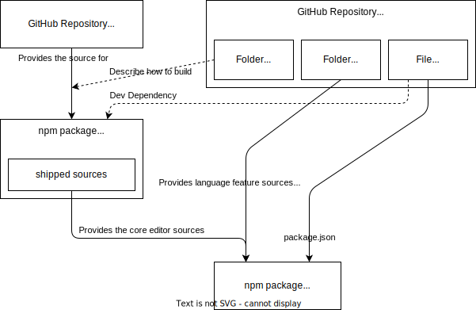
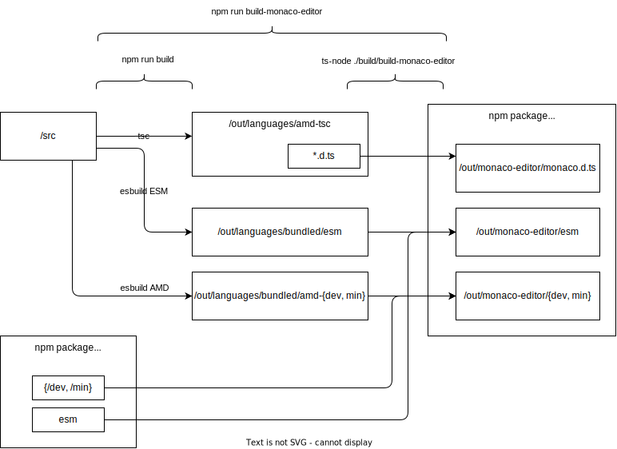

# Contributing / Dev Setup

## Source Code Structure

It is important to understand that the Monaco Editor _Core_ is built directly
from the [VS Code source code](https://github.com/microsoft/vscode). The Monaco
Editor then enhances the Monaco Editor Core with some basic language features.

This diagram describes the relationships between the repositories and the npm
packages:



By default, `monaco-editor-core` is installed from npm (through the initial
`npm install`), so you can work on Monaco Editor language features without
having to build the core editor / VS Code. The nightly builds build a fresh
version of `monaco-editor-core` from the `main` branch of VS Code. For a stable
release, the commit specified in `vscodeRef` in [package.json](./package.json)
specifies the commit of VS Code that is used to build `monaco-editor-core`.

## Contributing a new tokenizer / a new language

Please understand that we only bundle languages with the monaco editor that have
a significant relevance (for example, those that have an article in Wikipedia).

-   create `$/src/basic-languages/{myLang}/{myLang}.contribution.ts`
-   create `$/src/basic-languages/{myLang}/{myLang}.ts`
-   create `$/src/basic-languages/{myLang}/{myLang}.test.ts`
-   edit `$/src/basic-languages/monaco.contribution.ts` and register your new
    language
-   create `$/website/index/samples/sample.{myLang}.txt`

```js
import "./{myLang}/{myLang}.contribution";
```

## Debugging / Developing The Core Editor

To debug core editor issues.

This can be done directly from the VS Code repository and does not involve the
monaco editor repository.

-   Clone the [VS Code repository](https://github.com/microsoft/vscode):
    `git clone https://github.com/microsoft/vscode`
-   Open the repository in VS Code: `code vscode`
-   Run `yarn install`
-   Select and run the launch configuration "Monaco Editor Playground" (this
    might take a while, as it compiles the sources):

    

-   Now you can set breakpoints and change the source code

    

-   Optionally, you can build `monaco-editor-core` and link it to the monaco
    editor repository:

    ```bash
    # builds out-monaco-editor-core
    gulp > yarn editor-distro
    
    out-monaco-editor-core > cd
    link > npm
    ../path/to/monaco-editor > cd
    
    # symlinks the monaco-editor-core package to the out-monaco-editor-core folder we just built
    link > npm monaco-editor-core
    ```

## Debugging / Developing Language Support

To debug bundled languages, such as JSON, HTML or TypeScript/JavaScript.

-   Clone the
    [monaco editor repository](https://github.com/microsoft/monaco-editor):
    `git clone https://github.com/microsoft/monaco-editor`
-   Open the repository in VS Code: `code monaco-editor`
-   Run `npm install`
-   Select and run the launch configuration "Monaco Editor Playground" (this
    might take a while, as it compiles the sources):

    

-   Now you can set breakpoints and change the source code

    

-   Optionally, you can build `monaco-editor` and link it if you want to test
    your changes in a real application:

    ```bash
    # builds out/monaco-editor
    run > npm build-monaco-editor
    
    out/monaco-editor > cd
    link > npm
    
    ../path/to/my-app > cd
    link > npm monaco-editor
    ```

## Running the editor tests

```bash
run > npm build-monaco-editor
run > npm test
run > npm compile --prefix webpack-plugin

run > npm package-for-smoketest-webpack
run > npm package-for-smoketest-esbuild
run > npm package-for-smoketest-vite
run > npm package-for-smoketest-parcel --prefix test/smoke/parcel
run > npm smoketest-debug
```

## Running the website locally

```bash
install > npm
run > npm build-monaco-editor

website > cd
install > yarn
typedoc > yarn
dev > yarn
```

Now webpack logs the path to the website.

## Out Folders

This diagram describes the output folders of the build process:



## Maintaining

Checkout [MAINTAINING.md](./MAINTAINING.md) for common maintaining tasks (for
maintainers only).
